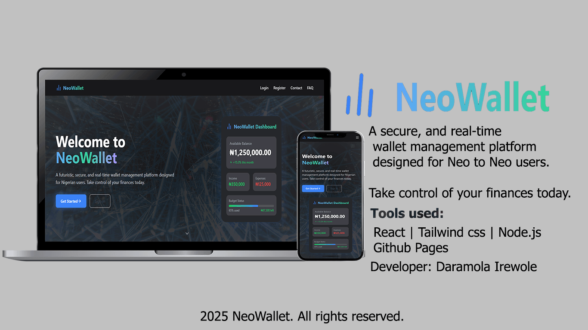

Here's a professional and stylish `README.md` for your **NeoWallet** project, including the correct GitHub Pages link:

---

```markdown
# 💸 NeoWallet — Modern Personal Finance App

**NeoWallet** is a futuristic, secure, and real-time wallet management platform designed for Nigerian users. Built with **React**, **Tailwind CSS**, and **Supabase**, it offers seamless wallet transfers, budget tracking, admin control, and rich animations — all wrapped in a sleek glassmorphic UI.

🔗 **Live Demo:** [https://dammydx.github.io/NeoWallet/]

      (https://dammydx.github.io/NeoWallet/)

---

## 🚀 Features

### 👋 Welcome Page
- Animated glassmorphic landing page with glowing CTAs
- Links to Login, Register, and Admin panel

### 🔠Authentication
- Email/password login via Supabase
- Email confirmation notice
- Protected routes using JWT
- Password reset with toast notifications

### 🦠User Dashboard
- Account Number (copyable), Current Balance, Income, Expenses, Budget
- Monthly and category-based charts
- Export transaction data as `.csv`

### 💸 Transactions
- Add, edit, delete, and categorize transactions
- Support for recurring entries
- Filter by date, type, or category

### 🔠Wallet Transfers
- Wallet-to-wallet transfer by account number
- Real-time updates on both sender and receiver side

### 📊 Budgeting
- Set monthly limits
- Visual bar and toast alerts for overspending

### 🔔 Notifications
- Real-time toast messages for user actions

### 🛠 Admin Control Panel
- Accessible at `/admin` with static password
- Manage user accounts, balances, and activity

### âš™ï¸ Settings Page
- Update profile info, biometric login, currency selector
- Theme toggle with light/dark glassmorphic designs

### 📠Contact Page
- Static contact form with email and WhatsApp info

### â“ FAQ Page
- Answers to common user questions

### 📃 Terms Page
- Table of Contents navigation + important disclaimers

---

## 📦 Technologies Used

- **React + TypeScript**
- **Vite**
- **Tailwind CSS**
- **Supabase**
- **Framer Motion**
- **React Router DOM**
- **Luxon** (Date handling)
- **Recharts** (Charts)
- **React Toastify** (Notifications)

---

## 🛠 Setup & Development

1. **Install dependencies**  
   ```bash
   npm install
   ```

2. **Run locally**  
   ```bash
   npm run dev
   ```

3. **Build for production**  
   ```bash
   npm run build
   ```

4. **Drag and Drop Hosting**  
   - Run `npm run build`  
   - Upload the `dist/` folder to [GitHub Pages](https://pages.github.com/) or [Netlify](https://netlify.com)

---

## 📠Directory Overview

```
public/
  logo.svg

src/
  assets/
  components/
  pages/
  lib/hooks/
  App.tsx
  main.tsx

index.html
vite.config.ts
tailwind.config.ts
```
---

## ğŸ–¼ï¸ Mockup Preview

Here’s a preview of NeoWallet in action:




---

## 📜 License

**MIT License**  
Project developed by **Daramola Irewole** — proudly sponsored by **DammyTechHub**.

---

## 🙌 Credits

Icons from **Heroicons**, charts from **Recharts**, and date management via **Luxon**.

```

---

Let me know if you'd like me to also write `SETUP.md` and `FUTURE_UPDATES.md`!
